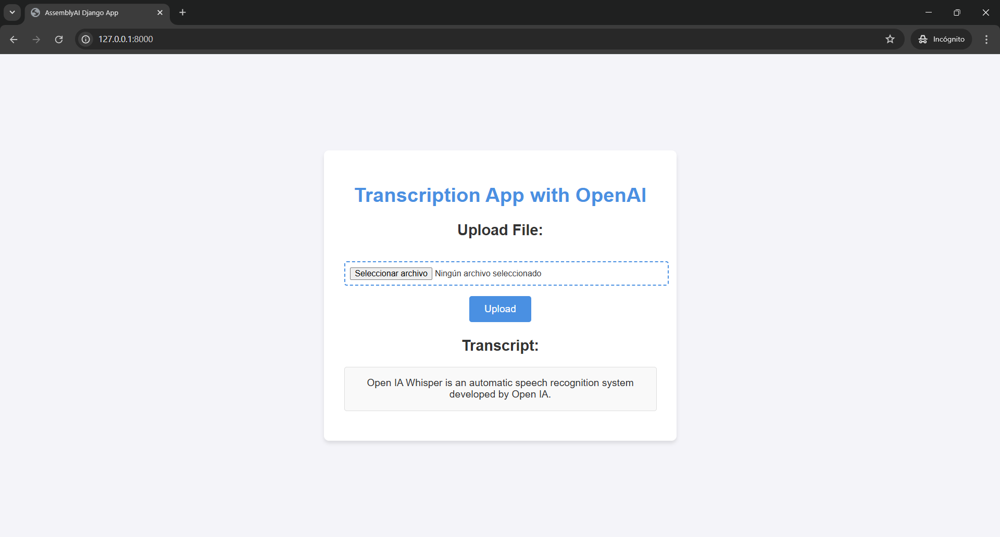

# Django Speech-to-Text app

A simple Django app that allows users to upload and transcribe audio files in a Django app.



## Get Started

Step 1: Install dependencies:

```
pip install Django assemblyai python-dotenv
```

Step 2: Create and .env file in the `/stt_project/` path and enter your OpenAI API Key.

```
OPENAI_API_KEY=your_key_here
```

Step 3: Run the server

```
cd stt_project
python manage.py runserver
```
